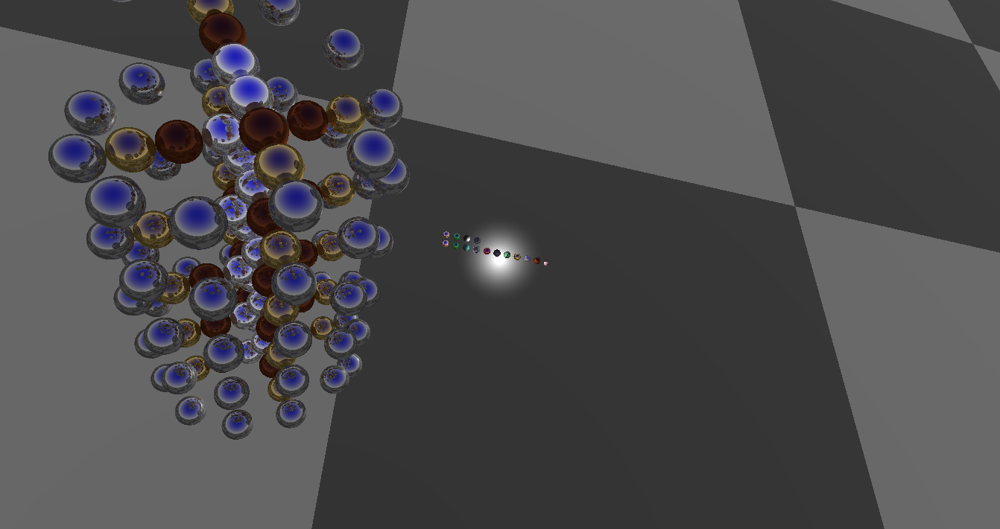
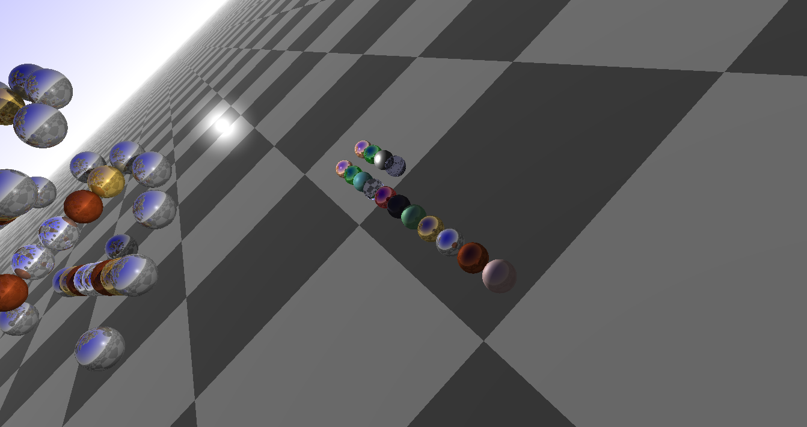
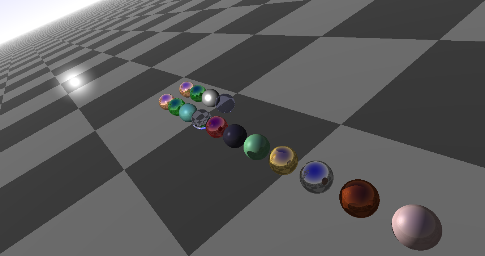
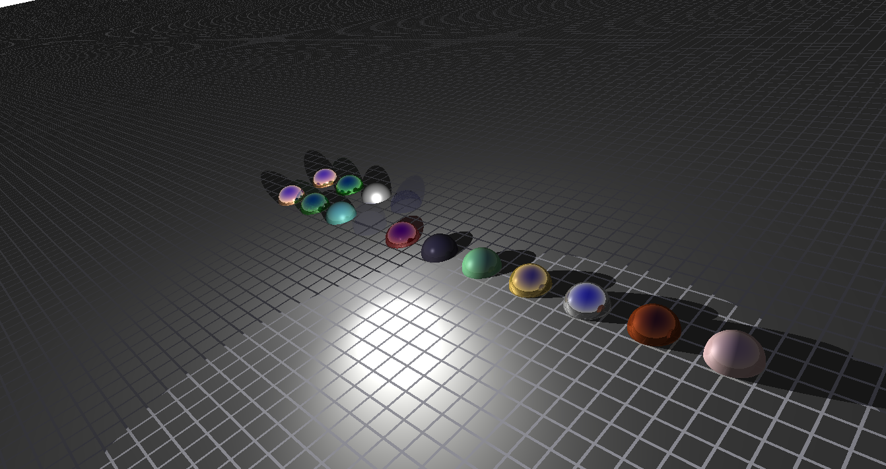
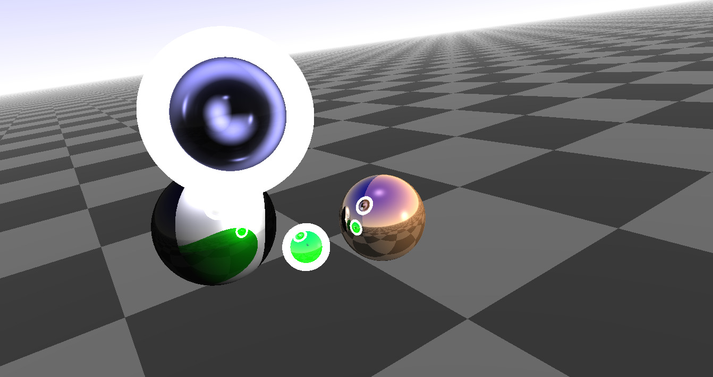
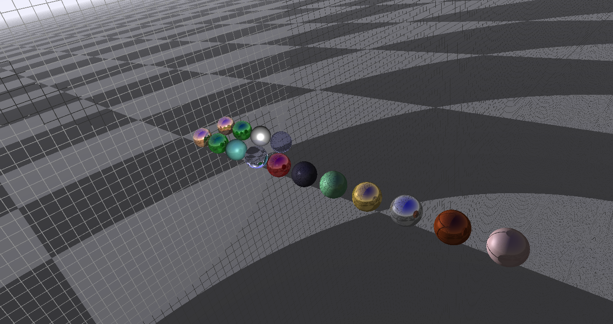

# Author

Commandeur Nicolas
Verdant Benjamin

## Questions réalisées

Toutes les questions jusqu'à la 4.5.

Un début de plan infini mais pas fonctionnel : pour l'activer décommenter la ligne 99 du fichier *ray-tracer.cpp*.

Anti-aliasing (question 5.3) fonctionnel : aller à la ligne 85 du fichier *Viewer.cpp* et décommenter celui voulu.

Une fonction addAdn est dispo dans *ray-tracer.cpp* pour ajouter des branches d'adn.

Quelques matériaux en plus ont été rajoutés : *obsidian*, *ruby*, *pearl*, cf voir *Material.h*

## Images 

Le plan peu fonctionnel :

Quelques ratés :

