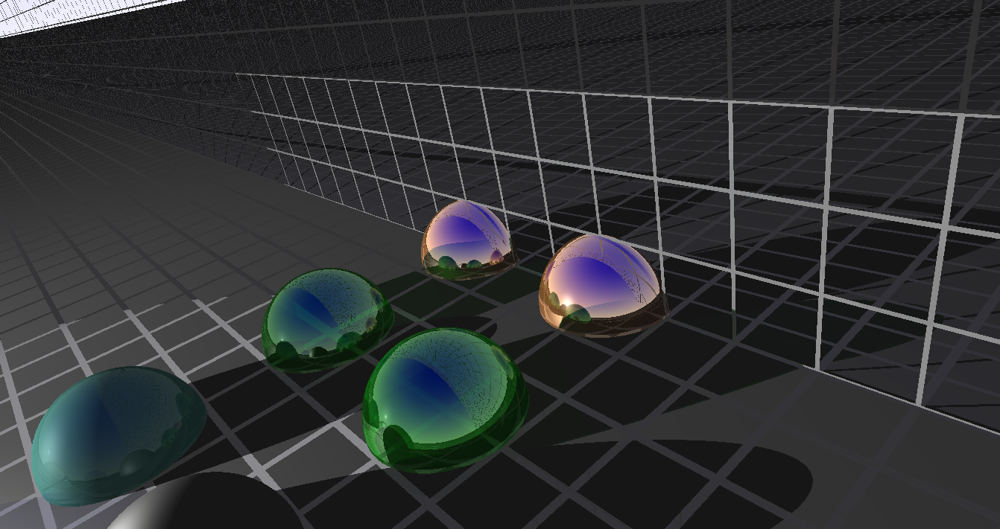

# Author

Commandeur Nicolas
Verdant Benjamin

## Questions réalisées

Toutes les questions jusqu'à la 4.5.

Un début de plan infini mais pas totalement fonctionnel : le plan horizontal est fonctionnel mais le vertical (celui en mirroir) ne reflète pas les objets. Le plan horizontal est activé de base (lignes 95-97). Le plan vertical est en commentaire, pour l'activer décommenter les lignes 98-100 du fichier *ray-tracer.cpp*.

Anti-aliasing (question 5.3) fonctionnel : aller à la ligne 85 du fichier *Viewer.cpp* et décommenter celui voulu.

Une fonction addAdn est dispo dans *ray-tracer.cpp* pour ajouter des branches d'adn.

Quelques matériaux en plus ont été rajoutés : *obsidian*, *ruby*, *pearl*, cf voir *Material.h*

## Images

Le plan peu fonctionnel :

## Anciens bugs

Black hole :

Ombre bizzare :

## Dépôt git

[Git](https://github.com/FayxChance/RayTracingC-)#
